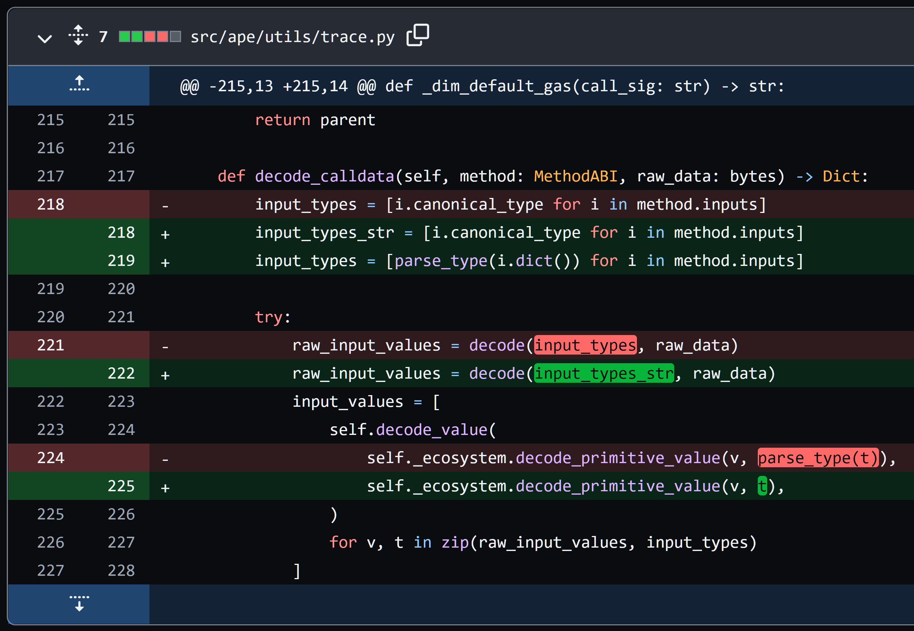

# ape-ethereum-bug

Shows minimal reproducible example of the seaport advanced order decoding bug.

`ape 0.5.4` had this bug.

The transaction that causes the bug: `0x998f1810cc06f7c0aa3a6094082278e882a53a35a57a4f1094213ec78ca45931`.

Minimum code to reproduce the bug:

```python
#!/usr/bin/env python
import os
from ape import networks, Contract

etherscan_api_key = ''
if not etherscan_api_key:
    raise Exception("you must set ETHERSCAN_API_KEY")

context = networks.parse_network_choice('ethereum:mainnet:geth')
context.__enter__()
receipt = networks.provider.get_receipt('0x998f1810cc06f7c0aa3a6094082278e882a53a35a57a4f1094213ec78ca45931')
receipt.show_trace()
```

## Detective work in trying to find what is causing the bug

Start with the `main.py`. My debugging led me first to that MVP code to reproduce the bug.

However, I quickly realised that it wasn't that area of code that was causing the issue.

By noticing that the `output_type` in `main.py` does not coform to the actual method input type, I realise that the bug was in `ape.utils` in `parse_type` function.

You can now move to `ape_utils_bug.py`. There I indicate what that function should in fact produce. At this point, I noticed that we can easily use `ABIType` which inherits from `BaseModel` so has nice `dict` properties and we can potentially parse the type recursively by using the `components` property on it.

This, finally, led me to the solution and the fix in `abi_type_parse.py`.

The [issue](https://github.com/ApeWorX/ape/issues/1122) I opened, and the [PR](https://github.com/ApeWorX/ape/pull/1123) that fixes it.

## The Fix

I removed the old `parse_type` and replaced it with the one in `abi_type_parse.py`. Note, that signature of my implementation does not match with the previous version, which does break the API. However, the old version was buggy and cannot be relied on.

Finally, we just need to udpate the `decode_calldata` and `decode_returndata`, the only places where `parse_type` was used.


